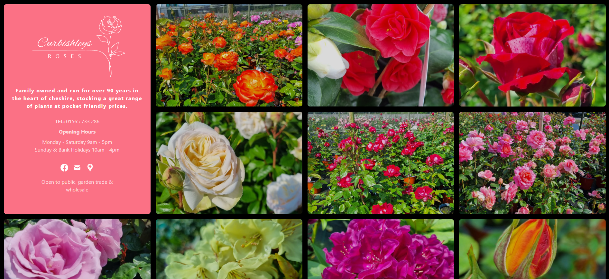

<div align="center">


  <h1>Curbishleys Roses Website</h1>
  
  <p>
    Family owned and run for over 90 years in the heart of cheshire, stocking a great range of plants at pocket friendly prices.
  </p>
</div>


## Table of Contents

- [About](#about)
  * [Screenshots](#screenshots)
  * [Tech Stack](#tech-stack)
- [Installation](#installation)

## About

Simple image based site for Curbishleys Rose Nursery. Based on the Next JS / Cloudinary example, however all Cloudinary functionality was removed and the 
image references stored locally so that the site could be hosted statically with provides that don't off environment variable support for free.

### Screenshots 



### Tech Stack

- [Tailwind CSS](https://tailwindcss.com)
- [Next.js](https://nextjs.org)

## Installation

To install and set up the project, follow these steps:

1. Clone the repository: 

    ```
    git clone [repository url]
    ```

2. Navigate to the project directory: cd [project directory]
3. Install dependencies: 
    
    ```
    npm install
    ```
